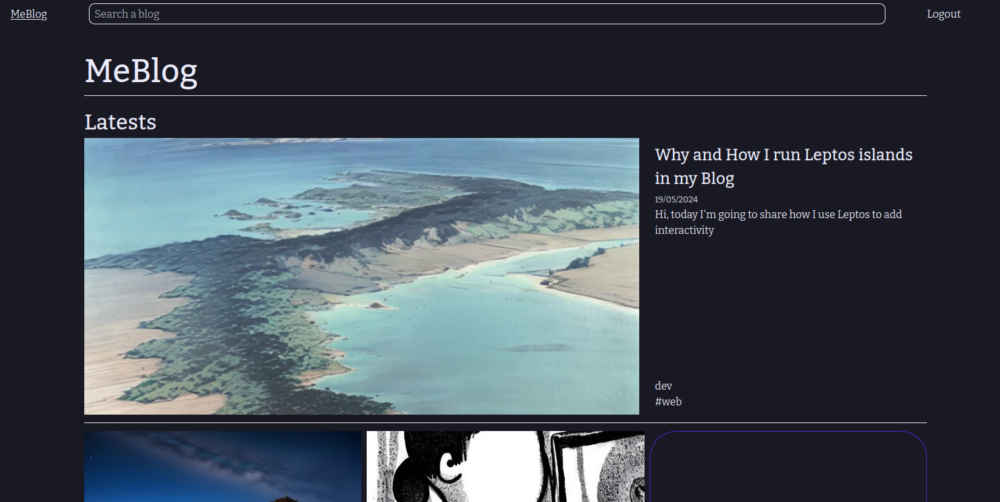
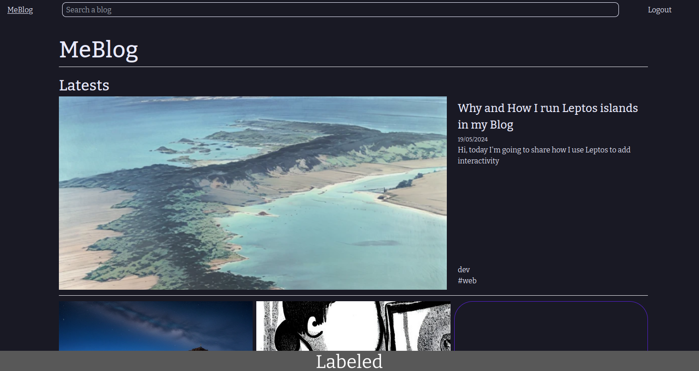

# img-labeler

CLI utility that adds a label of a given title to an image.
It is a learning project for furute features on other projects, it is instended to be used to generate images for github markdowns.

But, you can use it as you want.

## Install

```bash
git clone https://github.com/ocxide/img-labeler.git
```

## Run

> [!IMPORTANT]
> A default font is loaded from the cargo manifest directory. A font should be provided if this command is executed outside this context. 

cd into your clone and run

```bash
cargo r -- --source=./static/example.png --output=./static/labeled.png --title=Labeled
```

It will transform the example image:


To this:

